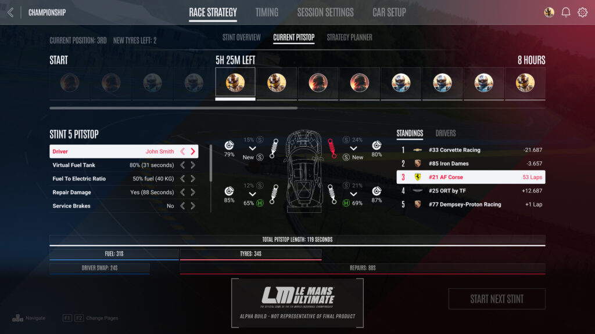

# Virtual Fuel Tank / Stint Energy Limits

Missing
{: .label .label-red}

In real life, the cars in the Hypercar and GTP categories for WEC and IMSA respectively both limit how much energy a car can use during a stint (i.e. between visits of the pit lane). This serves as a means to balance cars with vastly different technologies to compete generally around the same performance level - so that regardless on whether it's a very fuel efficient car with a powerful, front-wheel-drive based hybrid system like the Toyota GR010, or a more traditional car with only a naturally aspirated internal combustion engine, like the Glickenhaus SCG007, they can operate on a level playing field. For example, here are excerpts from the most recent WEC and IMSA BoP tables (with cars relevant to iRacing in bold):

## WEC Fuji 2023

| Manufacturer            | Mass (kg) | Power (KW) | Energy (MJ) | 
|:------------------------|:----------|:-----------|:------------|
| **Cadillac V-Series.R** | 1039      | 505        | 894         |
| Ferrari 499P            | 1076      | 505        | 898         |
| ~~Glickenhaus 007~~     | ~~1030~~  | ~~520~~    | ~~905~~     |
| Peugeot 9X8             | 1038      | 520        | 907         |
| **Porsche 963**         | 1054      | 514        | 907         |
| Toyota GR010            | 1080      | 514        | 907         |
| Vanwall Vandervell 680  | 1030      | 520        | 903         |

## IMSA Road Atlanta 2023

| Manufacturer            | Mass (kg) | Power (KW) | Energy (MJ) | 
|:------------------------|:----------|:-----------|:------------|
| **Acura ARX-06**        | 1046      | 520        | 915         |
| **BMW M Hybrid V8**     | 1031      | 513        | 903         |
| **Cadillac V-Series.R** | 1030      | 513        | 903         |
| **Porsche 963**         | 1037      | 515        | 907         |

What this in effect means is that instead of the fuel tank itself being the key thing that determines stint length, it's merely how much energy you are allocated. This opens up the scope of something along the lines of trying an 80/20 split of fuel and electrical energy for the stint and running the car lighter, but being exposed more to the whims of charging and deploying electrical energy, or running more fuel weight in the car, but reliably being able to run harder if there aren't many opportunities to recharge the batteries at that track.

Thus, the name virtual fuel tank - the time required to fill the "tank" represents how much energy is to be used in the upcoming stint for both ICE and electric motors, irrespective of how much fuel is actually being put in the car.

### Possible implementation

One possible way to implement this in a way that would be familiar to iRacing users is to adjust the fuel black box page (and include telemetry to output for third party applications) to include a percentage of the stint energy *remaining*, together with the fuel for the ICE and battery SoC.

One particular issue is that implementing this correctly means that there would be potential for stint energy to hit 0% whilst there is still fuel in the car. iRacing could levy a stop & hold penalty for excessive consumption, but I could imagine confusion from users who are unaware of these rules. Alternatively, like shown below, drivers could select a fuel-to-electric ratio and iRacing would only fuel the car as necessary - making the need to show fuel remaining somewhat unnecessary.

### Opinion

Whilst this is a fundamental feature of these cars, *iRacing only has has LMDh cars currently in the title* and thus stint energy as a BoP element is not yet necessary until the point where an LMH car has been licensed and built. Whilst an argument could be made in that IMSA too only has these LMDh cars in the GTP category, the fact is that it is possible that any LMH cars can compete in the category, provided they can meet IMSA's manufacturer requirements, means that they have to use this stint energy limit method. In the interrim, the standard iRacing BoP tools of ballast, power restrictors and fuel tank size are fine for the time being. 

I believe that as the cars stand right now, despite being an important missing feature, **it is not a priority to change this.**

### Note - Le Mans Ultimate implementation

I would be remiss to not mention that Studio 397 have [revealed screenshots of the UI for the upcoming Le Mans Ultimate game](https://lemansultimate.com/le-mans-ultimate-ui-preview-and-update-from-head-of-studio-397/), that also show an implementation of the VFT and stint energy limits:

Whilst it's unknown at present how this actually functions in the game, the fact it *is* there is quite important and something for iRacing to hopefully notice when the game eventually comes out.